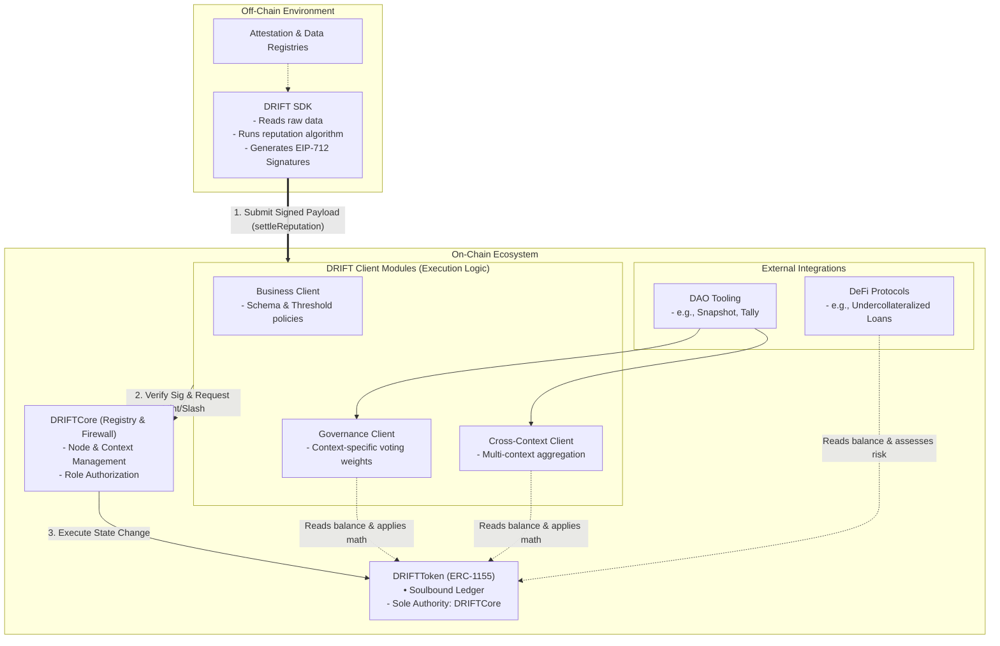
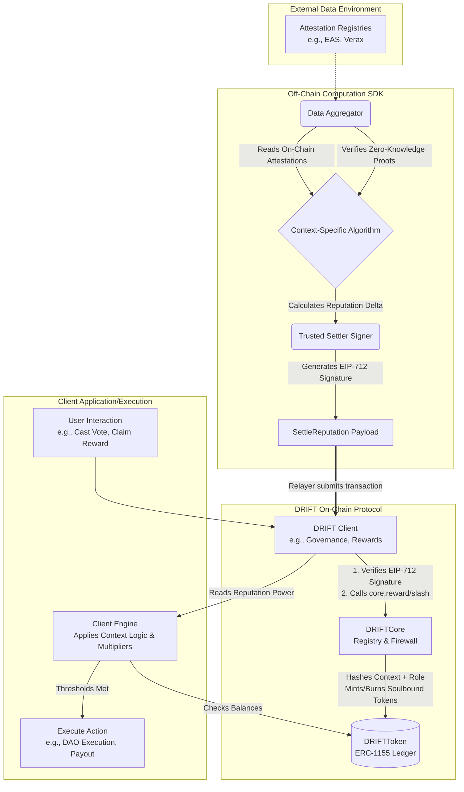

<h1 align="center">DRIFT</h1>

<h3 align="center"> Decentralized Reputation Infrastructure for Trust</h3>

<div align="center">


</div>

<br/>

## Introduction

The DRIFT protocol aims to work atop an existing Attestation Layer
(be it [EAS](https://attest.org/), [Verax](https://docs.ver.ax/verax-documentation), or a custom provider)
and provides context-scoped, privacy-preserving reputation infrastructure for Web3 and Web2 systems.

DRIFT won't directly store attestations (since there are plenty of systems that
excel at it), but instead will define trust boundaries within which those claims
are meaningful, and provides the on-chain primitives and off-chain tooling to
aggregate them into reputation scores.

DRIFT is designed around three principles:

- **Context isolation** — reputation is always scoped to a context. A node's score in a DePIN network is independent of its score in a DAO. Neither leaks into the other.

- **Attestation-source agnosticism** — DRIFT does not depend on any specific attestation provider. Any system that implements `IAttestationProvider` can serve as a data source.

- **Off-chain computation, on-chain trust** — reputation scores are computed off-chain (via The Graph and decentralized compute networks) and verified on-chain only when needed, keeping gas costs minimal.

## Core Concepts

### Context

A **context** is a namespaced reputation domain registered by a client (a DApp, a DAO, a DePIN network, etc.).
Each context defines:

- Which attestation **schemas** it accepts

- Which **adapter** verifies each schema

- A set of **admins** (via OZ AccessControl) who can manage the context

Contexts are globally unique by name. The UID is derived as `keccak256(name)`,
making it deterministic and human-derivable off-chain.

### Schema

A schema defines the structure of an attestation's data payload.
DRIFT does not store schema definitions — those live in the chosen attestation provider (e.g. EAS's `SchemaRegistry`).

DRIFT only stores whether a schema is **accepted within a given context**, referenced by its UID.

### Adapter

An **adapter** is a contract implementing `IAttestationProvider`.
It bridges DRIFT to a specific attestation backend, translating provider-specific
verification logic into DRIFT's `isValid()` interface.

DRIFT ships with a built-in **EAS adapter**.

### Node

Any entity (a user wallet, an off-chain server, or a sub-DAO) that registers within a Context to earn reputation.

### Role

A specific subset within a Context (e.g., `STUDENT` or `MODERATOR`).
Reputation is mathematically scoped to a specific Context + Role pair.

### DRIFT Client / Template

The execution layer (e.g., `WeightedGovernanceClient`).
These are modular, isolated smart contracts plugged into the Core. They define how reputation is used within a specific Context.

## Design Decisions

**Why not store attestations on-chain?**

TODO

**Why off-chain reputation computation?**

TODO

**Why ERC-1155 for reputation tokens?**

TODO

**Why soulbound tokens?**

TODO

## System Architecture

### Contract Design



### Reputation Lifetime




## Implementing a Client Contract

DRIFT is designed to be plug-and-play for DAOs and protocols.
A DAO's `Governor` contract registers a context and inherently receives the `CONTEXT_ADMIN` role.

To initialize a reputation context, a client must define:

- **Context Name:** Human-readable label (Namespacing is secured by hashing the name to prevent squatting).

Once registered, the context administrators configure the trust boundaries by adding schemas:

- **Accepted Schemas:** The specific UIDs of the schemas allowed in the context.

- **Provider Adapters:** The specific `IAttestationProvider` contract addresses (e.g., `EASAdapter`) that DRIFT will use to route and verify those specific schema UIDs.

## Deployments

| Network          | DRIFTCore | EASAdapter |
|------------------|-----------|------------|
| Ethereum Sepolia | —         | —          |
| Arbitrum Sepolia | —         | —          |
| Avalanche Fuji   | —         | —          |

Addresses will be populated on first deployment.

## Development

### Prerequisites

Testing:

- [Foundry](https://www.getfoundry.sh/) - testing, fuzzying

Solidity Contracts:

- [OpenZeppelin v5](https://www.openzeppelin.com/) - access control, upgradeability, ERC standards

EVM:

- [Cancun](https://www.evm.codes/?fork=cancun) - includes support for `ReentrancyGuardTransient` (EIP-1153)

### File Structure

```
DRIFT
├── sdk
│   └── example.js
├── src
│   ├── client
│   │   ├── DRIFTClientFactory.sol
│   │   ├── IDRIFTClientMetadata.sol
│   │   ├── IDRIFTClient.sol
│   │   ├── IDRIFTGovernance.sol
│   │   └── IDRIFTSettler.sol
│   ├── Common.sol
│   ├── core
│   │   ├── DRIFTCore.sol
│   │   ├── DRIFTCoreStorage.sol
│   │   └── IDRIFTCore.sol
│   ├── providers
│   │   ├── EAS.sol
│   │   └── IAttestationProvider.sol
│   ├── templates
│   │   ├── CrossContextGovernance.sol
│   │   ├── DemocraticGovernance.sol    // TODO
│   │   ├── QuadraticGovernance.sol     // TODO
│   │   └── WeightedGovernance.sol
│   └── token
│       ├── DRIFTToken.sol
│       └── IDRIFTToken.sol
└── test
    ├── core
    │   └── DRIFTCore.t.sol
    ├── examples
    │   └── University.t.sol
    ├── mocks
    │   ├── MockAdapter.sol
    │   └── MockEAS.sol
    ├── providers
    │   └── EASAdapter.t.sol
    └── templates
        └── WeightedGovernance.t.sol
```


### Setup

```bash
git clone https://github.com/drift-org/drift
cd drift

# Install Foundry dependencies
forge install

# Install JS dependencies
npm install  # or yarn install
```

### Build

```bash
forge build
```

### Test

```bash
forge test -vv
```

For gas snapshots:

```bash
forge snapshot
```

For gas reports:

```bash
forge snapshot --gas-report
```

For coverage:

```bash
forge coverage
```

## License

MIT
