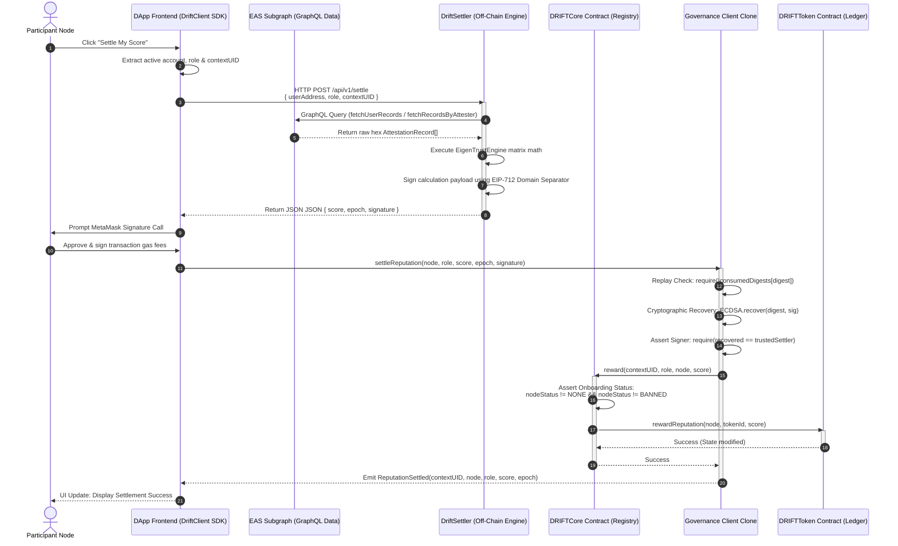

# DRIFT Smart Contracts

This repository contains the core smart contract primitives for DRIFT (Decentralized Reputation Infrastructure for Trust). DRIFT isolates structural participant verification, immutable identity-bound credential ledgers, and pluggable community governance execution templates.

The codebase utilizes a modular architecture deployed via cost-effective minimal proxy factories (EIP-1167 clones) to completely prevent on-chain state bloat and reduce deployment gas costs for context creators.

## Core Architecture Components

- `DRIFTCore.sol`: Manages organizational context spaces, handles schema links, and acts as the gatekeeper ledger for active node states.

- `DRIFTToken.sol`: An enterprise-grade multi-token registry (EIP-1155) acting as the underlying primitive for tracking identity-bound attributes. Transfers are explicitly short-circuited to guarantee soulbound credentials.

- `WeightedGovernanceClient.sol`: Consumes off-chain computational assertions (such as EigenTrust) by verifying EIP-712 signatures generated by a trusted settler. It handles proposal configurations and translates token ownership directly into flexible voting power coefficients.

## Implementing a Client Contract

DRIFT is designed to be plug-and-play for DAOs and protocols.
A DAO's `Governor` contract registers a context and inherently receives the `CONTEXT_ADMIN` role.

To initialize a reputation context, a client must define:

- **Context Name:** Human-readable label (Namespacing is secured by hashing the name to prevent squatting).

Once registered, the context administrators configure the trust boundaries by adding schemas:

- **Accepted Schemas:** The specific UIDs of the schemas allowed in the context.

- **Provider Adapters:** The specific `IAttestationProvider` contract addresses (e.g., `EASAdapter`) that DRIFT will use to route and verify those specific schema UIDs.

## Deployments

| Network          | DRIFTCore | EASAdapter |
|------------------|-----------|------------|
| Ethereum Sepolia | —         | —          |
| Arbitrum Sepolia | —         | —          |
| Avalanche Fuji   | —         | —          |

Addresses will be populated on first deployment.

## System Architecture



## Development

### Prerequisites

Testing:

- [Foundry](https://www.getfoundry.sh/) - testing, fuzzying, deploying

Solidity Contracts:

- [OpenZeppelin v5](https://www.openzeppelin.com/) - access control, upgradeability, ERC standards

EVM:

- [Cancun](https://www.evm.codes/?fork=cancun) - includes support for `ReentrancyGuardTransient` (EIP-1153)

### Setup

```bash
git clone https://github.com/drift-org/DRIFT
cd DRIFT

# Install Foundry dependencies
forge install
```

### Execution Commands

**Compile Contracts**:

```bash
forge build
```

**Run unit tests**:

```bash
forge test -vv
```

**Generate Gas analysis**:

```bash
forge snapshot --gas-report
```

### Mainnet/Testnet Simulation

```bash
# Simulate execution directly on Avalanche Fuji
forge test --rpc-url https://api.avax-test.network/ext/bc/C/rpc --match-path test/providers/EASAdapter.t.sol
```

**Deploying the contract**:

```bash
export RPC_URL="https://ethereum-sepolia-rpc.publicnode.com" # for example
export PRIVATE_KEY="..."
export ETHERSCAN_API_KEY="..."
forge script script/Deploy.s.sol:DeployScript \
  --rpc-url $RPC_URL \
  --private-key $PRIVATE_KEY \
  --broadcast \
  --verify \
  -vvvv
```

You can also do:

```bash
export PRIVATE_KEY="..."
export ETHERSCAN_API_KEY="..."
forge script script/Deploy.s.sol:DeployScript \
  network_name \
  --private-key $PRIVATE_KEY \
  --broadcast \
  --verify \
  -vvvv
```

Check the `network_name` options in [`foundry.toml`](./foundry.toml).

**Dry deployment**:

```bash
forge script script/Deploy.s.sol:DeployScript --rpc-url $RPC_URL
```

**Local deployment**:

```bash
anvil --fork-url $SEPOLIA_RPC_URL --port 8545

forge script script/Deploy.s.sol:DeployScript --rpc-url http://127.0.0.1:8545 --broadcast
```

Here are some useful URLs:

- AVALANCHE: `https://api.avax.network/ext/bc/C/rpc`

- Arbitrum One: `https://arb1.arbitrum.io/rpc`

- Arbitrum Nova: `https://nova.arbitrum.io/rpc`

- Optimism: `https://mainnet.optimism.io/`

- Base: `https://1rpc.io/base`
