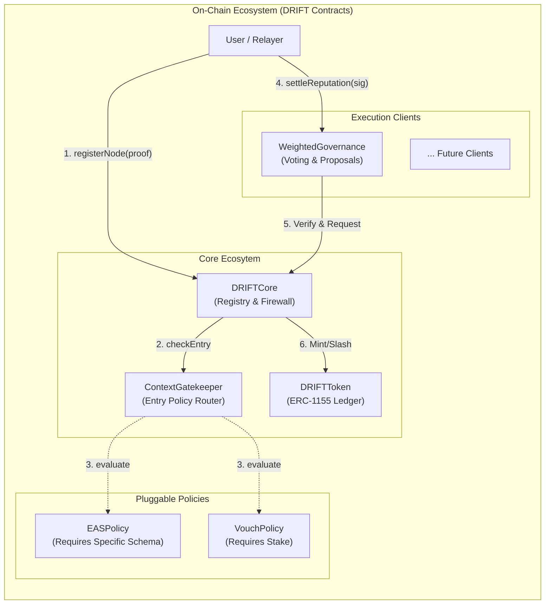

# DRIFT Smart Contracts

## Implementing a Client Contract

DRIFT is designed to be plug-and-play for DAOs and protocols.
A DAO's `Governor` contract registers a context and inherently receives the `CONTEXT_ADMIN` role.

To initialize a reputation context, a client must define:

- **Context Name:** Human-readable label (Namespacing is secured by hashing the name to prevent squatting).

Once registered, the context administrators configure the trust boundaries by adding schemas:

- **Accepted Schemas:** The specific UIDs of the schemas allowed in the context.

- **Provider Adapters:** The specific `IAttestationProvider` contract addresses (e.g., `EASAdapter`) that DRIFT will use to route and verify those specific schema UIDs.

## Deployments

| Network          | DRIFTCore | EASAdapter |
|------------------|-----------|------------|
| Ethereum Sepolia | —         | —          |
| Arbitrum Sepolia | —         | —          |
| Avalanche Fuji   | —         | —          |

Addresses will be populated on first deployment.

## Development

### File Structure

```
contracts
├── src
│   ├── client
│   │   ├── DRIFTClientFactory.sol
│   │   ├── IDRIFTClientMetadata.sol
│   │   ├── IDRIFTClient.sol
│   │   ├── IDRIFTGovernance.sol
│   │   └── IDRIFTSettler.sol
│   ├── Common.sol
│   ├── core
│   │   ├── DRIFTCore.sol
│   │   ├── DRIFTCoreStorage.sol
│   │   └── IDRIFTCore.sol
│   ├── core
│   │   ├── IPolicy.sol
│   │   └── EASPolicy.sol
│   ├── providers
│   │   ├── EAS.sol
│   │   └── IAttestationProvider.sol
│   ├── templates
│   │   ├── CrossContextGovernance.sol
│   │   ├── DemocraticGovernance.sol    // TODO
│   │   ├── QuadraticGovernance.sol     // TODO
│   │   └── WeightedGovernance.sol
│   └── token
│       ├── DRIFTToken.sol
│       └── IDRIFTToken.sol
└── test
    ├── core
    │   └── DRIFTCore.t.sol
    ├── examples
    │   └── University.t.sol
    ├── mocks
    │   ├── MockAdapter.sol
    │   └── MockEAS.sol
    ├── providers
    │   └── EASAdapter.t.sol
    └── templates
        └── WeightedGovernance.t.sol
```


### Prerequisites

Testing:

- [Foundry](https://www.getfoundry.sh/) - testing, fuzzying

Solidity Contracts:

- [OpenZeppelin v5](https://www.openzeppelin.com/) - access control, upgradeability, ERC standards

EVM:

- [Cancun](https://www.evm.codes/?fork=cancun) - includes support for `ReentrancyGuardTransient` (EIP-1153)

## System Architecture



### Setup

```bash
git clone https://github.com/drift-org/DRIFT
cd DRIFT

# Install Foundry dependencies
forge install

# Install JS dependencies
npm install  # or yarn install
```

### Build

```bash
forge build
```

### Test

```bash
forge test -vv
```

**To test build on different chains**:

```
forge test --rpc-url <rpc_url>
```

Here are some useful URLs:

- AVALANCHE: `https://api.avax.network/ext/bc/C/rpc`

- Arbitrum One: `https://arb1.arbitrum.io/rpc`

- Arbitrum Nova: `https://nova.arbitrum.io/rpc`

- Optimism: `https://mainnet.optimism.io/`

- Base: `https://1rpc.io/base`

### Gas analysis

Snapshots:

```bash
forge snapshot
```

Report:

```bash
forge snapshot --gas-report
```

### coverage:

```bash
forge coverage
```
