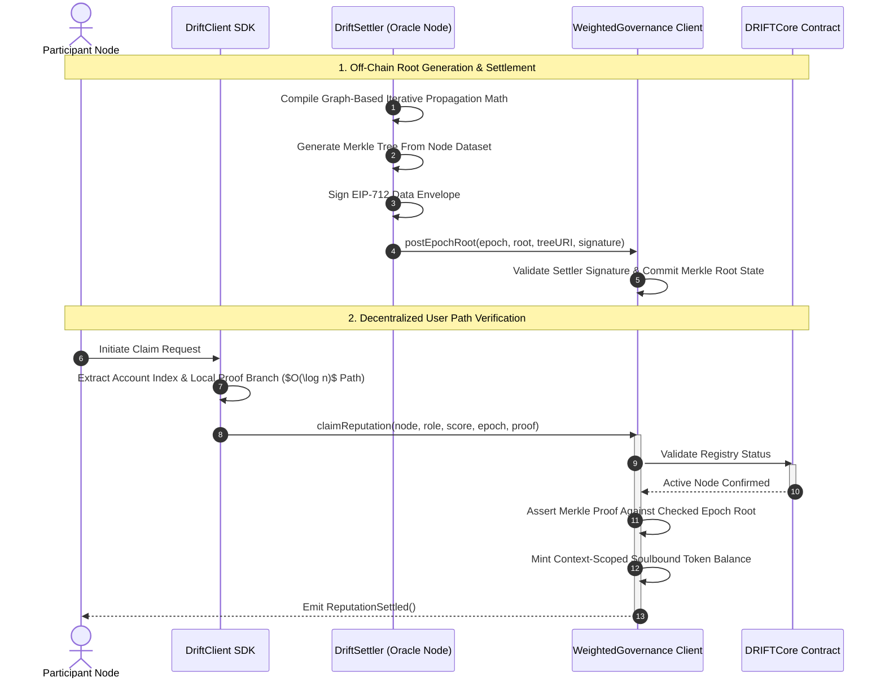

# DRIFT Smart Contracts

This package contains the foundational on-chain ledger and execution layers for DRIFT (Decentralized Reputation Infrastructure for Trust). The codebase establishes a secure boundary for context isolation, identity-bound credential registries, and pluggable governance modules.

To prevent state bloat and control initialization overhead for context builders, DRIFT utilizes **EIP-1167 Minimal Proxy Clones**, ensuring that deploying a secure meritocratic ecosystem scales efficiently under strict gas parameters.

## Core Architecture Components

- **DRIFTCore.sol:** The global administrative registry. It anchors organizational namespace allocations (`contextUID`), maintains active cryptographic data stream mappings (`schemaUID` whitelists), and governs participant verification states.

- **DRIFTToken.sol**: An identity-bound, soulbound **EIP-1155 Multi-Token Ledger** tracking score weights across isolated `(Context, Role)` vectors. Transfer operations are hard-coded to `revert` to prevent credential monetization or hijack exploits.

- **WeightedGovernanceClient.sol**: A pluggable, proof-of-state governance execution client. Unlike conventional token-weighted systems, it implements cryptographic verification via state proofs (`createProposalWithProofs` and `castVoteWithProofs`), enabling execution power to be driven by earned, epoch-pivoted reputation bounds.

## Implementing a Client Contract

DRIFT is designed for DAOs and protocols. A DAO's Governor contract registers a context and receives the `CONTEXT_ADMIN` role.

To initialize a reputation context, a client defines:

**Context Name:** A human-readable label. Namespacing is secured by hashing the name to prevent squatting.

Once registered, context administrators configure trust boundaries by adding schemas:

**Accepted Schemas:** The specific UIDs of schemas allowed in the context.

**Provider Adapters:** The `IAttestationProvider` contract addresses (e.g., `EASAdapter`) that DRIFT uses to route and verify those schema UIDs.

## System Architecture



## Development

### Prerequisites

Testing:

- [Foundry](https://www.getfoundry.sh/) - testing, fuzzing, deploying

Solidity Contracts:

- [OpenZeppelin v5](https://www.openzeppelin.com/) - access control, upgradeability, ERC standards

EVM:

- [Cancun](https://www.evm.codes/?fork=cancun) - includes support for `ReentrancyGuardTransient` (EIP-1153)

### Setup

```bash
git clone https://github.com/Dageus/DRIFT
cd DRIFT/packages/contracts

# Install Foundry dependencies
forge install
```

**Foundry submodules**:

```bash
forge install foundry-rs/forge-std
forge install OpenZeppelin/openzeppelin-contracts
forge install OpenZeppelin/openzeppelin-contracts-upgradeable
```

### Execution Commands

**Compile Contracts**:

```bash
forge build
```

**Run unit tests**:

```bash
forge test -vv
```

**Generate Gas analysis**:

```bash
forge snapshot --gas-report
```

### Mainnet/Testnet Simulation

```bash
# Simulate execution directly on Avalanche Fuji
forge test --rpc-url https://api.avax-test.network/ext/bc/C/rpc --match-path test/providers/EASAdapter.t.sol
```

**Deploying the contract**:

```bash
export RPC_URL="https://ethereum-sepolia-rpc.publicnode.com" # for example
export PRIVATE_KEY="..."
export ETHERSCAN_API_KEY="..."
forge script script/Deploy.s.sol:DeployScript \
  --rpc-url $RPC_URL \
  --private-key $PRIVATE_KEY \
  --broadcast \
  --verify \
  -vvvv
```

You can also do:

```bash
export PRIVATE_KEY="..."
export ETHERSCAN_API_KEY="..."
forge script script/Deploy.s.sol:DeployScript \
  network_name \
  --private-key $PRIVATE_KEY \
  --broadcast \
  --verify \
  -vvvv
```

Check the `network_name` options in [`foundry.toml`](./foundry.toml).

**Dry deployment**:

```bash
forge script script/Deploy.s.sol:DeployScript --rpc-url $RPC_URL
```

**Local deployment**:

```bash
export RPC_URL="..."
anvil --fork-url $RPC_URL --port 8545

forge script script/Deploy.s.sol:DeployScript --rpc-url http://127.0.0.1:8545 --broadcast
```

Here are some useful URLs:

- Arbitrum One: `https://arb1.arbitrum.io/rpc`

- Arbitrum Nova: `https://nova.arbitrum.io/rpc`

- Optimism: `https://mainnet.optimism.io/`

- Base: `https://1rpc.io/base`

## Local Testing

**Simulating L1 chain**:

```bash
anvil --block-time 12 --gas-limit 30000000
```

**Simulating L2 chain**:

```bash
anvil --port 8546 --block-time 0.25 --gas-price 100000000
```
