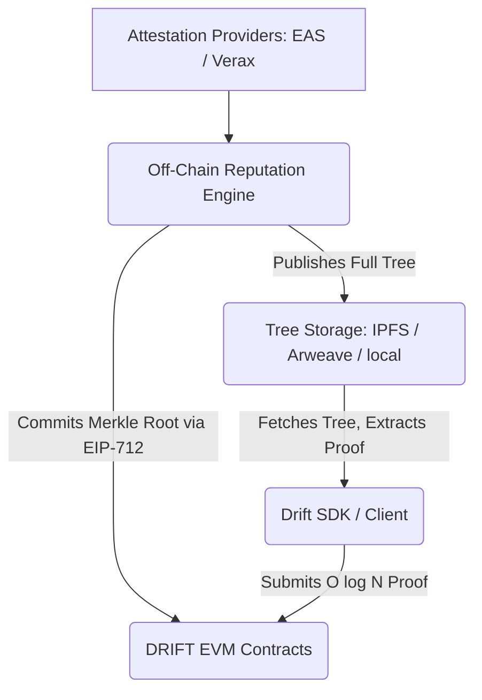

# DRIFT SDK

Client-side library for the DRIFT reputation protocol: registering contexts and nodes, computing
subjective (local) or committed (on-chain) reputation, and driving Merkle-proven governance —
proposals, voting, and non-inclusion disputes — against a deployed DRIFT client.

## Architecture Overview

DRIFT separates **state generation** (off-chain) from **state verification** (on-chain) to stay
within EVM gas limits: reputation is computed off-chain over the full attestation graph, a
settler commits a single Merkle root on-chain at O(1) cost, and users verify their own state
against that root at O(log N) cost via Merkle proofs.



- **Attestations** are sourced from external providers (EAS today, Verax planned) via
  `IAttestationProvider`.
- **Reputation engines** (`EigenTrustEngine`, `TemporalDecayEngine`, `WeightedLocalEngine`)
  compute a score from a set of attestations — either committed on-chain by a settler, or
  purely locally over a viewer's own subjective trust graph.
- **Settlement**: `DriftSettler` builds a `StandardMerkleTree` from an epoch's scores, signs the
  root (EIP-712), and `reputation.postEpochRoot(...)` posts it on-chain — one O(1) transaction
  regardless of graph size.
- **Non-inclusion disputes**: any admitted node can challenge an epoch root that omits them; an
  unanswered challenge rolls the epoch back for correction. See `reputation.challengeOmission`
  and the other dispute methods on `ReputationModule`.

## Settlement Tiers

1. **Tier 1 — single trusted settler (shipped):** one address — an EOA or an ERC-1271
   smart-contract wallet such as a Safe — signs and posts the epoch root. Non-inclusion is
   contestable on-chain; the settlement signature itself is not yet a threshold scheme.
2. **Tier 2 — threshold / SMPC:** key distribution across a staked, decentralized committee.
3. **Tier 3 — ZK coprocessor:** trustless — a zero-knowledge verifier replaces the settler.

## Installation

```bash
npm install @drift-network/sdk ethers @openzeppelin/merkle-tree
```

## Quick Start

```ts
import { Drift } from '@drift-network/sdk';
import { EASProvider } from '@drift-network/sdk/providers';
import { Wallet, JsonRpcProvider } from 'ethers';

const signer = new Wallet(privateKey, new JsonRpcProvider(rpcUrl));

const drift = new Drift(signer, {
  coreAddress: '0x...',
  factoryAddress: '0x...',
  attestationProvider: new EASProvider('https://sepolia.easscan.org/graphql', schemaUID)
});

// Join a context
const contextUID = await drift.core.registerContext('my.community');
await drift.core.registerNode(contextUID, '0x');

// Committed (on-chain) reputation for one role
const { balance } = await drift.getReputation(signer.address, {
  mode: 'global',
  context: contextUID,
  role: memberRole
});

// Subjective (off-chain) reputation from the signer's own trust graph
await drift.setTrust(signer.address, someAttester, 8000);
const { score } = await drift.getReputation(signer.address, {
  mode: 'local',
  context: contextUID,
  viewer: signer.address,
  schemaUID
});
```

## Package Layout

The package root exports the framework-agnostic core — `Drift`, `DriftSettler`, `SchemaEncoder`,
shared types, and the error hierarchy. Everything else lives at its own subpath so consumers only
pull in what they use:

| Subpath | Exports |
|---|---|
| `@drift-network/sdk/engines` | `EigenTrustEngine`, `TemporalDecayEngine`, `WeightedLocalEngine`, `REPUTATION_ENGINES` |
| `@drift-network/sdk/providers` | `EASProvider`, `IAttestationProvider` |
| `@drift-network/sdk/trust` | `LocalTrustStore` (browser), `NodeTrustStore` (Node), `ITrustStore` |
| `@drift-network/sdk/merkle` | `LocalTreeStore`, `IMerkleStore` — Node-only, settler/oracle-side |

`Drift`'s constructor already picks the right trust store for its environment automatically
(`LocalTrustStore` in a browser, `NodeTrustStore` under Node) — reach into `/trust` directly only
for a custom `storageDir` or your own `ITrustStore` implementation.

## Error Handling

Every error the SDK throws intentionally extends `DriftError`:

```ts
import { DriftContractRevertError, DriftError } from '@drift-network/sdk';

try {
  await drift.core.registerContext('taken.name');
} catch (e) {
  if (e instanceof DriftContractRevertError) {
    console.log(e.revertName, e.revertArgs); // e.g. "ContextTaken", { contextUID }
  } else if (e instanceof DriftError) {
    // any other recognized SDK failure
  } else {
    throw e; // unexpected — don't swallow it
  }
}
```
