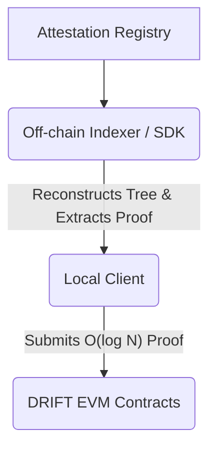

# DRIFT SDK

The DRIFT SDK is a unified TypeScript library designed to orchestrate decentralized identity pipelines, modular trust metrics, and flexible governance models. It cleanly abstracts EIP-712 cryptographic assertions, dynamic EIP-1167 proxy client creation, and off-chain reputation network graphs.

## Architecture Overview

DRIFT enforces a strict separation between state generation and state verification to bypass EVM computation limits. The EVM is relegated strictly to an $O(1)$ settlement and verification layer.

* **Data Layer:** Attestations are sourced from decentralized registries (EAS/Verax).
* **Off-Chain Compute Layer:** Reputation Engines (e.g., EigenTrust) compute global trust graphs.
* **Client-Side Proving (MVP):** The SDK reconstructs the Merkle tree locally, extracting $O(\log n)$ sibling proofs.
* **On-Chain Settlement:** The EVM verifies the proof against an $O(1)$ historical state root, enforcing Stateless Governance Checkpointing.



## Progressive Trust Settlement (The Three Tiers)

DRIFT isolates execution from settlement, ensuring contexts can upgrade their security assumptions without migrating state. To guarantee future improvability, the MVP mandates SNARK-friendly accumulators (e.g., Poseidon) from genesis.

1. **Tier 1 — Threshold Multisig (MVP):** A trusted committee settles the off-chain state root. Data Availability (DA) relies on off-chain indexing or L1 calldata.
2. **Tier 2 — SMPC:** Cryptographic key distribution across a staked decentralized committee.
3. **Tier 3 — ZK Coprocessor:** Trustless. The multisig is replaced by an on-chain zero-knowledge verifier (e.g., RISC Zero).

## Installation

```bash
npm install @drift-protocol/sdk ethers @openzeppelin/merkle-tree
```

## Quick Start: Client-Side Proof Execution

In the MVP architecture, synchronous DeFi composability via EIP-3668 (CCIP Read) is deferred. Users interact with the protocol via decentralized client-side proving. The SDK fetches the tree, extracts the proof, and executes the governance action directly.

```typescript
import { Drift, DriftSettler, EASProvider } from '@drift-protocol/sdk';
import { JsonRpcProvider, Wallet } from 'ethers';

// 1. Initialize SDK
const provider = new JsonRpcProvider(process.env.RPC_URL);
const voterWallet = new Wallet(process.env.PRIVATE_KEY!, provider);

const drift = new Drift(voterWallet, {
  coreAddress: "0xCore...",
  factoryAddress: "0xFactory...",
  attestationProvider: new EASProvider("https://sepolia.easscan.org/graphql", "0xSchema...")
});

const settler = new DriftSettler(voterWallet);

async function executeGovernanceVote() {
  const clientAddress = "0xGovernanceClient...";
  const contextUID = "0xContext...";
  const voterAddress = await voterWallet.getAddress();
  const snapshotEpoch = 1n;

  // 2. Fetch the off-chain tree state (Simulated via local JSON or IPFS fetch)
  const treeData = await fetch(`https://storage.network/trees/${contextUID}_${snapshotEpoch}.json`).then(res => res.json());

  // 3. Extract the O(log N) inclusion proof locally
  const payload = settler.generateProofOfStatePayload(
    treeData, 
    contextUID, 
    voterAddress, 
    snapshotEpoch
  );

  // 4. Submit the proof to the EVM for stateless verification
  const proposalId = 0n;
  const support = true;

  const tx = await drift.governance.castVoteWithProofs(
    clientAddress,
    proposalId,
    support,
    payload
  );

  const receipt = await tx.wait();
  console.log(`Vote cast successfully. Gas used: ${receipt.gasUsed}`);
}

executeGovernanceVote();
```
