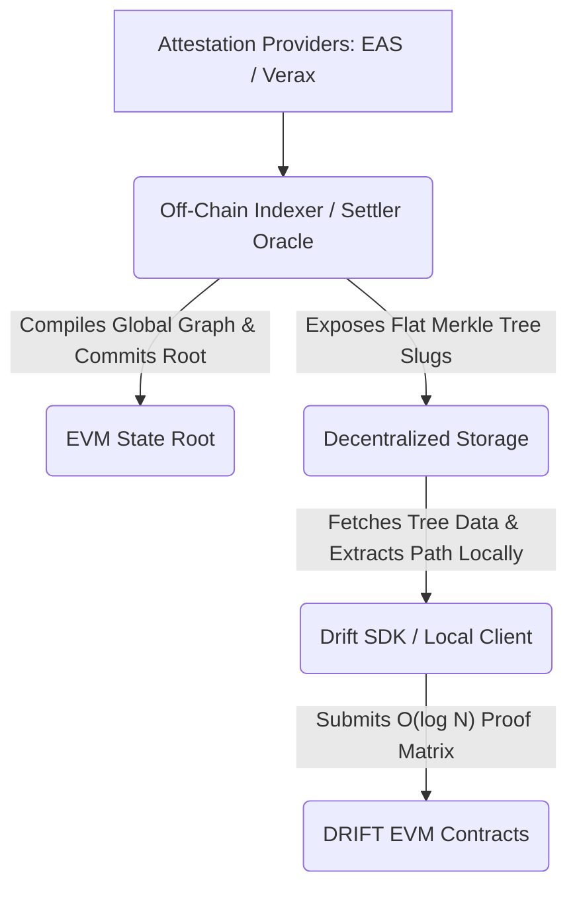

# DRIFT SDK

The DRIFT SDK is the unified client-side library designed to orchestrate decentralized identity pipelines, modular trust metrics, and flexible governance models. It cleanly abstracts EIP-712 cryptographic assertions, dynamic EIP-1167 proxy client configurations, and local Merkle proof extraction.

## Architecture Overview

DRIFT enforces a strict separation between state generation and state verification to bypass EVM computation limits. The EVM is relegated strictly to an $O(1)$ settlement and verification layer.

DRIFT enforces a strict separation between **state generation** and **state verification** to bypass EVM execution constraints. Heavy graph calculations are handled completely off-chain, leaving the smart contract layer to act as a lightweight, constant-cost verification engine.



- **The Data Stream:** Attestations are sourced dynamically from on-chain identity platforms (e.g., Ethereum Attestation Service).

- **Off-Chain Computation:** The Reputation Engine sweeps raw dependency logs to establish role-weighted contextual trust parameters.

- **Accountable Oracles:** A dedicated Settler network bundles the global state matrix into a single root, signs an EIP-712 envelope, and posts it on-chain at a constant gas cost.

- **Client-Side Proving:** The SDK downloads the flat tree structure, isolates a user's index pointer, and constructs localized Merkle branch paths instantly without exposing the user to global storage lookup fees.

## Progressive Trust Settlement

To ensure future platform adaptability, DRIFT isolates execution hooks from the core ledger standard. This permits environments to update their global consensus assumptions without mutating or rewriting user states:

1. **Tier 1 — Threshold Multisig (MVP):** A trusted committee settles the off-chain state root. Data Availability (DA) relies on off-chain indexing or L1 calldata.
2. **Tier 2 — SMPC:** Cryptographic key distribution across a staked decentralized committee.
3. **Tier 3 — ZK Coprocessor:** Trustless. The multisig is replaced by an on-chain zero-knowledge verifier (e.g., RISC Zero).

## Installation

```bash
npm install @drift-protocol/sdk ethers @openzeppelin/merkle-tree
```
