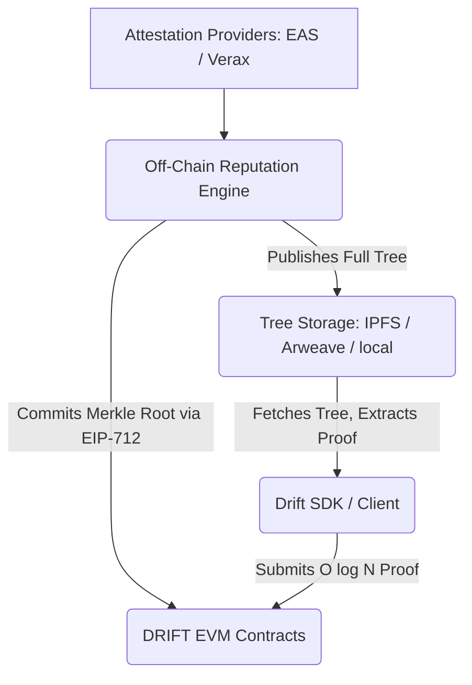

# DRIFT SDK

Client-side library for the DRIFT reputation protocol: registering contexts and nodes, computing
subjective (local) or committed (on-chain) reputation, and driving Merkle-proven governance —
proposals, voting, and non-inclusion disputes — against a deployed DRIFT client.

## Architecture Overview

DRIFT separates **state generation** (off-chain) from **state verification** (on-chain) to stay
within EVM gas limits: reputation is computed off-chain over the full attestation graph, a
settler commits a single Merkle root on-chain at O(1) cost, and users verify their own state
against that root at O(log N) cost via Merkle proofs.


```mermaid
graph TD
    A[Attestation Providers: EAS / Verax] --> B(Off-Chain Reputation Engine)
    B -- Commits Merkle Root via EIP-712 --> C(DRIFT EVM Contracts)
    B -- Publishes Full Tree --> D(Tree Storage: IPFS / Arweave / local)
    D -- Fetches Tree, Extracts Proof --> E(Drift SDK / Client)
    E -- Submits O log N Proof --> C
```

- **Attestations** are sourced from external providers (EAS today, Verax planned) via
  `IAttestationProvider`.
- **Reputation engines** (`EigenTrustEngine`, `TemporalDecayEngine`, `WeightedLocalEngine`)
  compute a score from a set of attestations — either committed on-chain by a settler, or
  purely locally over a viewer's own subjective trust graph.
- **Settlement**: `DriftSettler` builds a `StandardMerkleTree` from an epoch's scores, signs the
  root (EIP-712), and `reputation.postEpochRoot(...)` posts it on-chain — one O(1) transaction
  regardless of graph size.
- **Non-inclusion disputes**: any admitted node can challenge an epoch root that omits them; an
  unanswered challenge rolls the epoch back for correction. See `reputation.challengeOmission`
  and the other dispute methods on `ReputationModule`.

## Settlement Tiers

The tiers differ in who computes the epoch root and what the chain checks. Claims, votes and disputes work the same way under every tier.

1. **Tier 1, one trusted settler (implemented).** One key computes the root and signs and posts it (`settleEpochTier1`). Non-inclusion is contestable on chain. An incorrectly computed root is publicly detectable, because anyone can recompute it, but it is not adjudicated on chain.
2. **Tier 2, replicated committee (implemented).** The trusted settler is a t-of-n Safe. Each owner computes the epoch itself and signs only a root it computed. A wrong root then needs t corrupted owners. The client already accepts a Safe through ERC-1271, so no contract changes. The owners coordinate by commit-reveal over a relay (`/pipeline`). That rule is enforced off chain: the Safe accepts any t owner signatures, so commit-reveal gives honest owners a procedure to follow and signed evidence against a copier.
3. **Tier 3, validity proof (experimental).** The Rust engine can prove an epoch in the RISC Zero zkVM (`packages/engines`), but no contract verifies the proof yet. Proving the reference engine takes minutes for a handful of nodes and hours for tens of nodes, so it is not usable for live settlement yet.

## Installation

```bash
npm install @drift-network/sdk ethers @openzeppelin/merkle-tree
```

## Quick Start

```ts
import { Drift } from '@drift-network/sdk';
import { EASProvider } from '@drift-network/sdk/providers';
import { Wallet, JsonRpcProvider } from 'ethers';

const signer = new Wallet(privateKey, new JsonRpcProvider(rpcUrl));

const drift = new Drift(signer, {
  coreAddress: '0x...',
  factoryAddress: '0x...',
  attestationProvider: new EASProvider('https://sepolia.easscan.org/graphql', schemaUID)
});

// Join a context
const contextUID = await drift.core.registerContext('my.community');
await drift.core.registerNode(contextUID, '0x');

// Committed (on-chain) reputation for one role
const { balance } = await drift.getReputation(signer.address, {
  mode: 'global',
  context: contextUID,
  role: memberRole
});

// Subjective (off-chain) reputation from the signer's own trust graph
await drift.setTrust(signer.address, someAttester, 8000);
const { score } = await drift.getReputation(signer.address, {
  mode: 'local',
  context: contextUID,
  viewer: signer.address,
  schemaUID
});
```

## Package Layout

The package root exports the framework-agnostic core — `Drift`, `DriftSettler`, `SchemaEncoder`,
shared types, and the error hierarchy. Everything else lives at its own subpath so consumers only
pull in what they use:

| Subpath | Exports |
|---|---|
| `@drift-network/sdk/engines` | `EigenTrustEngine`, `TemporalDecayEngine`, `WeightedLocalEngine`, `REPUTATION_ENGINES`; the epoch-engine boundary `IEpochEngine`, `LocalEpochEngine` and the protocol helpers (`inputDigest`, `encodeJournal`, ...) |
| `@drift-network/sdk/engines/remote` | `GrpcEpochEngine` (a remote engine server, checked as untrusted), `CommitteeEpochEngine` (t-of-n signed journals). Loads gRPC, so it is kept off `/engines`. |
| `@drift-network/sdk/providers` | `EASProvider`, `IAttestationProvider` |
| `@drift-network/sdk/trust` | `LocalTrustStore` (browser), `NodeTrustStore` (Node), `ITrustStore` |
| `@drift-network/sdk/merkle` | `buildEpochTree`, `checkEpochTree`, `findLeaves`, `resolveEpochTree`; `LocalTreeStore`, `IMerkleStore`; `IPFSTreeTransport`, `ITreeTransport` |
| `@drift-network/sdk/safe` | `SafeSettler` and the Safe v1.4.1 transaction helpers for a Safe as trusted settler |
| `@drift-network/sdk/pipeline` | `loadEpochSnapshot`, `settleEpochTier1`, the Tier 2 steps, `FileSettlementRelay` |

`Drift`'s constructor already picks the right trust store for its environment automatically
(`LocalTrustStore` in a browser, `NodeTrustStore` under Node) — reach into `/trust` directly only
for a custom `storageDir` or your own `ITrustStore` implementation.

## Settling an Epoch

Settlement reads the chain as it stood at the epoch boundary t_E, so every party that settles or checks an epoch gets the same input.

`loadEpochSnapshot` builds the engine input for one epoch. It refuses to run until the provider's finalized head is past t_E (O1). It then fetches the attestations as of t_E, keeps one schema, and rebuilds membership at t_E from the registry's events. The result is the attestations between members and every (node, role) pair held at t_E: one leaf each, matching exactly the pairs the contract would accept an omission challenge for. Pass `fromBlock` as the core's deployment block on RPCs that limit log ranges. A `fromBlock` after the context was created would drop members and cost the settlement bond, so the SDK refuses one.

### Tier 1

```ts
import { DriftSettler } from '@drift-network/sdk';
import { LocalEpochEngine } from '@drift-network/sdk/engines';
import { IPFSTreeTransport, LocalTreeStore } from '@drift-network/sdk/merkle';
import { loadEpochSnapshot, settleEpochTier1 } from '@drift-network/sdk/pipeline';

const snapshot = await loadEpochSnapshot({ provider, client, epoch, attestations, schemaUID, fromBlock });
const { root, treeURI, txHash } = await settleEpochTier1({
  settler: new DriftSettler(settlerSigner), // must be the client's trustedSettler
  client,
  snapshot,
  engine: new LocalEpochEngine(),
  transport: new IPFSTreeTransport({ apiUrl }),
  store: new LocalTreeStore('./trees') // keep a copy to answer challenges
});
```

`settleEpochTier1` computes the root, uploads the tree in canonical form, pins it and saves it locally, all before posting with the client's settlement bond.

### Tier 2

Each Safe owner runs the same steps with its own engine and its own view of the chain. Every step can be called repeatedly and never blocks: it returns `'waiting'` until its window opens, `'done'` when it acts, and `'already-done'` afterwards, so a scheduler can drive it.

```ts
import { SafeSettler } from '@drift-network/sdk/safe';
import {
  FileSettlementRelay, proposeEpochTier2, commitEpochTier2, revealEpochTier2,
  publishEpochTreeTier2, signEpochTier2, executeEpochTier2
} from '@drift-network/sdk/pipeline';

const base = { safeSettler: new SafeSettler(provider, safe, client), relay: new FileSettlementRelay('./relay') };
const compute = { snapshot: { provider, attestations, schemaUID, fromBlock }, engine: new LocalEpochEngine() };

const { proposalId } = await proposeEpochTier2({ ...base, proposer: owner, epoch });   // any owner
await commitEpochTier2({ ...base, owner, proposalId, compute });                         // before the commit deadline
await revealEpochTier2({ ...base, owner, proposalId, compute });                         // after it
await publishEpochTreeTier2({ ...base, owner, proposalId, compute, transport, store });  // once t reveals agree
await signEpochTier2({ ...base, owner, proposalId, transport, store });                  // checks and pins the tree first
await executeEpochTier2({ ...base, sender: anyone, proposalId });                       // anyone with gas
```

The proposal announces only the epoch and the deadlines, never the root. Owners commit to their own root before any reveal exists. An owner whose root differs from the agreed one cannot publish or sign, and `executeEpochTier2` counts only signatures from owners with a matching, timely reveal. `FileSettlementRelay` suits owners who share a directory; any `ISettlementRelay` implementation works, and the relay is not trusted.

### Remote and committee engines

`GrpcEpochEngine` calls an engine server over the protocol in `packages/protos/drift/engine/v1`. The Rust server is in `packages/engines`, and `packages/engines/SPEC.md` defines the protocol. The client treats the server as untrusted: it recomputes the input digest and the Merkle root from the returned scores, and checks the journal and any signature. `CommitteeEpochEngine` gathers t-of-n signed journals from several such servers as an off-chain audit trail.

### `treeURI`: publishing and resolving the settled tree

`postEpochRoot` and `EpochRootPosted` carry a `treeURI`, but the contract never stores or resolves it. Resolving it is the SDK's job. Pass the on-chain root when fetching: the gateway is not trusted, the root is.

```ts
import { IPFSTreeTransport, resolveEpochTree, findLeaves } from '@drift-network/sdk/merkle';

const transport = new IPFSTreeTransport({ gatewayUrl });

// From chain state: committed root, the matching EpochRootPosted event, fetch and check.
const { tree } = await resolveEpochTree(provider, client, epoch, transport);
const [leaf] = findLeaves(tree, myAddress, role); // value and proof for claimReputation

// Or with a treeURI and root you already have:
const checked = await transport.fetchTree(treeURI, { root: committedRoot, contextUID, epoch });
```

`resolveEpochTree` handles epochs that were rolled back and re-posted: it takes the newest event whose root is still committed, and skips URIs that are unreachable or serve the wrong tree. Trees are built in canonical order, so identical scores always publish identical bytes and the same CID. See `examples/treeuri-ipfs.ts` for an IPFS round trip.

## Error Handling

Every error the SDK throws intentionally extends `DriftError`:

```ts
import { DriftContractRevertError, DriftError } from '@drift-network/sdk';

try {
  await drift.core.registerContext('taken.name');
} catch (e) {
  if (e instanceof DriftContractRevertError) {
    console.log(e.revertName, e.revertArgs); // e.g. "ContextTaken", { contextUID }
  } else if (e instanceof DriftError) {
    // any other recognized SDK failure
  } else {
    throw e; // unexpected — don't swallow it
  }
}
```
